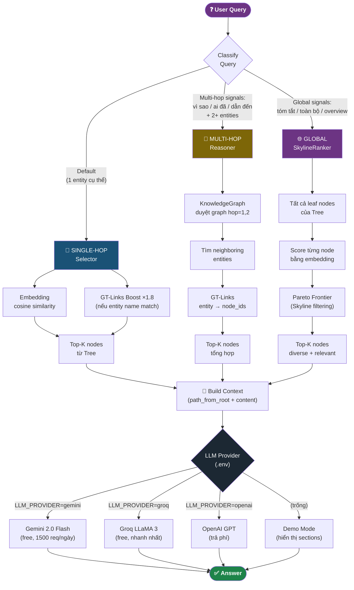

# BookRAG — Sơ Đồ Mermaid 3 Thành Phần
> Dữ liệu thực tế từ `data/classroom_elite.txt` + `src/book_index.py`

---

## Sơ Đồ 1: Hierarchical Tree

```mermaid
graph TD
    ROOT(["🗂 LỚP HỌC ĐỀ CAO THỰC LỰC"])

    ROOT --> CH1["📖 Chương 1: Giới Thiệu"]
    ROOT --> CH2["📖 Chương 2: Nhân Vật"]
    ROOT --> CH3["📖 Chương 3: Sự Kiện"]
    ROOT --> CH4["📖 Chương 4: Hệ Thống"]
    ROOT --> CH5["📖 Chương 5: Quan Hệ"]

    CH1 --> S11["1.1 Thông Tin Tác Phẩm\n(light novel, 2015, anime 2017)"]
    CH1 --> S12["1.2 Bối Cảnh\n(Tokyo Advanced Nurturing HS)"]
    CH1 --> S13["1.3 Hệ Thống Lớp & Điểm S\n(A→B→C→D, Class/Private Points)"]
    CH1 --> S14["1.4 Chủ Đề Chính\n(Thực lực là tất cả)"]

    CH2 --> S21["2.1 Ayanokoji Kiyotaka\n(thiên tài ẩn, lớp D, White Room)"]
    CH2 --> S22["2.2 Horikita Suzune\n(thủ lĩnh lớp D, mục tiêu lớp A)"]
    CH2 --> S23["2.3 Kushida Kikyou\n(mặt nạ hoàn hảo, hai mặt)"]
    CH2 --> S24["2.4 Sakayanagi Arisu\n(nữ hoàng lớp A, biết White Room)"]
    CH2 --> S25["2.5 Ichinose Honami\n(biểu tượng lớp B, lãnh đạo tốt bụng)"]
    CH2 --> S26["2.6 Ryuuen Kakeru\n(bạo chúa lớp C → đồng minh)"]
    CH2 --> S27["2.7 Horikita Manabu\n(anh trai, Hội Trưởng)"]
    CH2 --> S28["2.8 Chabashira Sae\n(GVCN lớp D, ép Ayanokoji)"]
    CH2 --> S29["2.9 Ayanokoji Touya\n(cha, sáng lập White Room)"]
    CH2 --> S210["2.10 Koenji Rokusuke\n(thiên tài ích kỷ, không kiểm soát được)"]

    CH3 --> S31["3.1 Sự Thức Tỉnh Lớp D\n(100k điểm S → 0, bài học đầu)"]
    CH3 --> S32["3.2 Kỳ Thi Đảo Hoang\n(Island Exam, Ryuuen bắt đầu nghi ngờ)"]
    CH3 --> S33["3.3 Ryuuen Phát Hiện Ayanokoji\n(gián điệp → đối đầu → thua)"]
    CH3 --> S34["3.4 Bí Mật Kushida Bị Đe Dọa\n(Kushida phá hoại Horikita)"]
    CH3 --> S35["3.5 Kỳ Thi Tàu Thuyền\n(Sakayanagi xác nhận biết White Room)"]
    CH3 --> S36["3.6 Đe Dọa Từ Cha\n(Touya cử sản phẩm White Room đến)"]

    CH4 --> S41["4.1 Kỳ Thi Đặc Biệt\n(Special Exams, ảnh hưởng điểm S)"]
    CH4 --> S42["4.2 Hệ Thống Điểm S\n(lớp + cá nhân, phiếu bảo vệ)"]
    CH4 --> S43["4.3 Hội Học Sinh\n(Manabu → Nagumo)"]
    CH4 --> S44["4.4 Căn Phòng Trắng\n(White Room, huấn luyện từ sơ sinh)"]

    CH5 --> S51["5.1 Ayanokoji & Horikita\n(dùng Horikita như người tiền tuyến)"]
    CH5 --> S52["5.2 Ayanokoji & Sakayanagi\n(đối kháng + tôn trọng)"]
    CH5 --> S53["5.3 Ayanokoji & Ryuuen\n(sau thua → độc lập, không phá bĩnh)"]
    CH5 --> S54["5.4 Kushida & Horikita\n(căm thù vì bí mật trường cũ)"]

    style ROOT fill:#6c3483,color:#fff,font-weight:bold
    style CH1 fill:#1a5276,color:#fff
    style CH2 fill:#1a5276,color:#fff
    style CH3 fill:#1a5276,color:#fff
    style CH4 fill:#1a5276,color:#fff
    style CH5 fill:#1a5276,color:#fff
```



---

## Sơ Đồ 2: Knowledge Graph

```mermaid
graph LR
    %% ── PERSONS ──────────────────────────────
    AY(["👤 Ayanokoji"])
    AYK(["👤 Ayanokoji Kiyotaka"])
    AYT(["👤 Ayanokoji Touya"])
    HOR(["👤 Horikita"])
    HORS(["👤 Horikita Suzune"])
    HORM(["👤 Horikita Manabu"])
    KUS(["👤 Kushida"])
    KUSK(["👤 Kushida Kikyou"])
    SAK(["👤 Sakayanagi"])
    SAKA(["👤 Sakayanagi Arisu"])
    SAKT(["👤 Sakayanagi Tomoya"])
    ICH(["👤 Ichinose"])
    ICHI(["👤 Ichinose Honami"])
    RYU(["👤 Ryuuen"])
    RYUK(["👤 Ryuuen Kakeru"])
    CHA(["👤 Chabashira"])
    CHAS(["👤 Chabashira Sae"])
    KOE(["👤 Koenji"])
    KOER(["👤 Koenji Rokusuke"])
    SUD(["👤 Sudo Ken"])
    NAG(["👤 Nagumo"])

    %% ── CONCEPTS & CLASSES ───────────────────
    CPT(["💡 Căn Phòng Trắng"])
    WR(["💡 White Room"])
    DS(["💡 điểm S"])
    KTD(["💡 kỳ thi đặc biệt"])
    LA(["🏫 lớp A"])
    LB(["🏫 lớp B"])
    LC(["🏫 lớp C"])
    LD(["🏫 lớp D"])
    HHS(["🏛 Hội Học Sinh"])
    PS(["❓ perfect student"])

    %% ── EDGES (29 relations) ─────────────────
    AY  -->|SECRETLY_LEADS|  LD
    AY  -->|MANIPULATES|     HOR
    AY  -->|RIVALS|          SAK
    AY  -->|DEFEATED|        RYU
    AY  -->|CREATED_BY|      CPT
    AY  -->|ESCAPED_FROM|    CPT
    AYT -->|FOUNDED|         CPT
    AYT -->|FATHER_OF|       AY
    AYT -->|WANTS_BACK|      AY
    HOR -->|LEADS|           LD
    HOR -->|HATED_BY|        KUS
    HOR -->|KNOWS_SECRET_OF| KUS
    HORM-->|BROTHER_OF|      HOR
    HORM-->|LEADS|           HHS
    KUS -->|HATES|           HOR
    KUS -->|PRETENDS_TO_BE|  PS
    KUS -->|BETRAYED|        LD
    SAK -->|LEADS|           LA
    SAK -->|KNOWS_ABOUT|     CPT
    SAK -->|WANTS_TO_DEFEAT| AY
    SAKA-->|DAUGHTER_OF|     SAKT
    RYU -->|LEADS|           LC
    RYU -->|DISCOVERED|      AY
    RYU -->|ALLIED_WITH|     AY
    ICH -->|LEADS|           LB
    CHA -->|KNOWS_SECRET_OF| AY
    CHA -->|BLACKMAILS|      AY
    KOE -->|MEMBER_OF|       LD
    KOE -->|UNCONTROLLED_BY| AY

    %% ── STYLES ───────────────────────────────
    style AY   fill:#a93226,color:#fff,font-weight:bold
    style AYK  fill:#c0392b,color:#fff
    style AYT  fill:#922b21,color:#fff
    style HOR  fill:#1f618d,color:#fff,font-weight:bold
    style HORS fill:#2e86c1,color:#fff
    style HORM fill:#2874a6,color:#fff
    style KUS  fill:#7d6608,color:#fff,font-weight:bold
    style KUSK fill:#9a7d0a,color:#fff
    style SAK  fill:#6c3483,color:#fff,font-weight:bold
    style SAKA fill:#7d3c98,color:#fff
    style ICH  fill:#1e8449,color:#fff,font-weight:bold
    style ICHI fill:#239b56,color:#fff
    style RYU  fill:#784212,color:#fff,font-weight:bold
    style RYUK fill:#935116,color:#fff
    style CHA  fill:#566573,color:#fff
    style CHAS fill:#717d7e,color:#fff
    style KOE  fill:#145a32,color:#fff
    style CPT  fill:#1c2833,color:#fff,font-weight:bold
    style WR   fill:#1c2833,color:#fff
    style LD   fill:#2c3e50,color:#fff,font-weight:bold
    style LA   fill:#27ae60,color:#fff
    style LB   fill:#2980b9,color:#fff
    style LC   fill:#e67e22,color:#fff
    style HHS  fill:#7f8c8d,color:#fff
```

---

## Sơ Đồ 3: GT-Links (Entity → Tree Nodes)

```mermaid
graph LR
    subgraph KG["KnowledgeGraph — Entities"]
        direction TB
        AY["Ayanokoji"]
        HOR["Horikita"]
        KUS["Kushida"]
        SAK["Sakayanagi"]
        ICH["Ichinose"]
        RYU["Ryuuen"]
        HORM["Horikita Manabu"]
        CHA["Chabashira"]
        AYT["Ayanokoji Touya"]
        KOE["Koenji"]
        SUD["Sudo Ken"]
        NAG["Nagumo"]
        CPT["Căn Phòng Trắng"]
        LD["lớp D"]
        LA["lớp A"]
        LB["lớp B"]
        LC["lớp C"]
        DS["điểm S"]
        HHS["Hội Học Sinh"]
        KTD["kỳ thi đặc biệt"]
    end

    subgraph TREE["HierarchicalTree — Nodes"]
        direction TB
        N13["1.3 Hệ Thống Lớp"]
        N21["2.1 Ayanokoji K."]
        N22["2.2 Horikita S."]
        N23["2.3 Kushida K."]
        N24["2.4 Sakayanagi A."]
        N25["2.5 Ichinose H."]
        N26["2.6 Ryuuen K."]
        N27["2.7 Horikita M."]
        N28["2.8 Chabashira"]
        N29["2.9 Ayanokoji T."]
        N210["2.10 Koenji R."]
        N31["3.1 Sự Thức Tỉnh"]
        N32["3.2 Đảo Hoang"]
        N33["3.3 Ryuuen Điều Tra"]
        N34["3.4 Bí Mật Kushida"]
        N35["3.5 Tàu Thuyền"]
        N36["3.6 Đe Dọa Từ Cha"]
        N41["4.1 Special Exams"]
        N42["4.2 Điểm S"]
        N43["4.3 Hội Học Sinh"]
        N44["4.4 White Room"]
        N51["5.1 Aya & Horikita"]
        N52["5.2 Aya & Sakayanagi"]
        N53["5.3 Aya & Ryuuen"]
        N54["5.4 Kushida & Horikita"]
    end

    AY  -.-> N21 & N22 & N24 & N26 & N27 & N28 & N210
    AY  -.-> N31 & N32 & N33 & N34 & N35 & N36
    AY  -.-> N51 & N52 & N53 & N54

    HOR -.-> N22 & N23 & N27 & N31 & N32 & N34 & N51 & N54

    KUS -.-> N23 & N34 & N54

    SAK -.-> N24 & N35 & N52

    ICH -.-> N25 & N35

    RYU -.-> N26 & N32 & N33 & N53

    HORM-.-> N27 & N43

    CHA -.-> N28

    AYT -.-> N29 & N36 & N44

    KOE -.-> N210

    SUD -.-> N31

    NAG -.-> N43

    CPT -.-> N21 & N24 & N29 & N35 & N36 & N44 & N52

    LD  -.-> N13 & N21 & N22 & N26 & N28 & N210 & N31 & N32 & N33 & N34 & N51

    LA  -.-> N13 & N22 & N24

    LB  -.-> N13 & N25

    LC  -.-> N13 & N26

    DS  -.-> N13 & N42

    HHS -.-> N27 & N43

    KTD -.-> N31 & N41

    style KG   fill:#1c2833,color:#fff
    style TREE fill:#1a5276,color:#fff
```



---

## Sơ Đồ 4: Luồng Xử Lý Query (BookRAG Pipeline)


